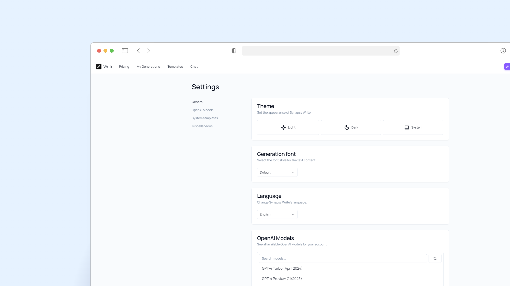
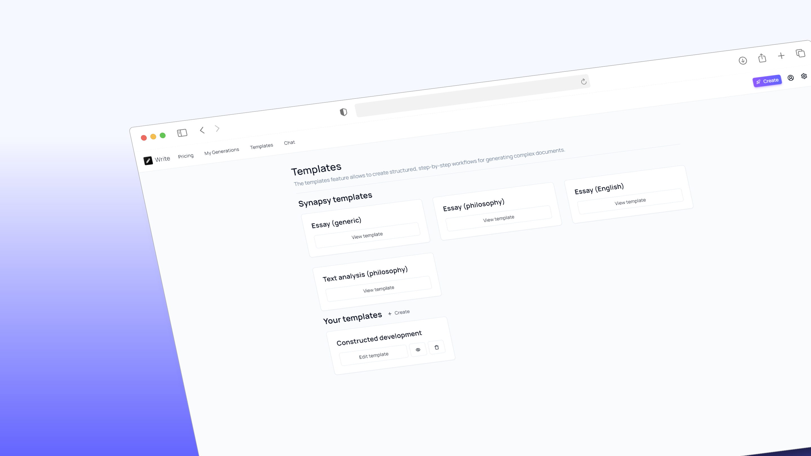
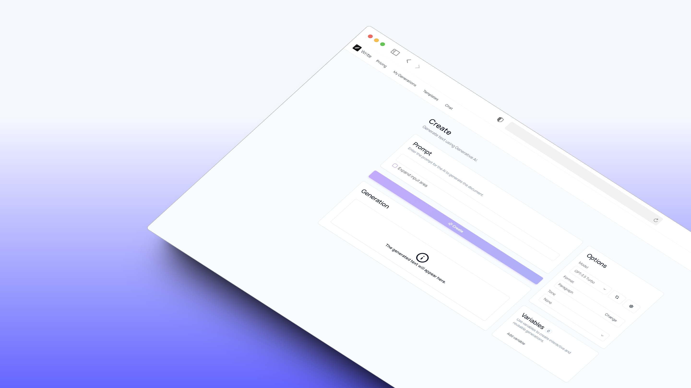

The world of AI-powered document and text generation is evolving, and Synapsy Write v3.0.0 is leading the charge. With this latest release, we have completely reworked the user interface and rewritten the code to handle complex document generation more effectively. This update is packed with new features, improvements, and fixes designed to enhance user experience and productivity. One of the standout features is the new Templates system, which allows users to automate the creation of complex documents through customizable models. Let's dive into the details.

## A Fresh User Interface and Codebase

Synapsy Write v3.0.0 is more than just an update; it's a transformation. We have redesigned the entire user interface to be more intuitive and user-friendly. The new layout and design elements make navigation seamless and enhance the overall usability of the application. Alongside the visual overhaul, we have also rewritten the underlying code to improve performance, reliability, and the capability to generate complex documents with ease.

## Introducing the Templates Feature

### What are Templates?

The new Templates feature is a game-changer for users who need to generate complex documents. Templates allow users to create a set of models that can automatically generate different parts of a document. This means you can design a procedure or algorithm to automate document creation, making the process faster and more consistent.

### How Does it Work?

1. **Creating Templates**: Users can now create templates from scratch. This involves defining the structure and content of the document parts, which can include anything from standard text sections to complex analyses.

2. **Editing and Customizing**: Once a template is created, it can be edited and customized to fit specific needs. The system provides a "Save" button in the Edit Template mode, ensuring that any changes are easily saved and applied.

3. **Using Templates**: Templates can be used to generate documents with just a few clicks. By selecting a template, users can quickly produce a document that adheres to the predefined structure and content rules.

4. **Managing Templates**: The Templates page allows users to view, edit, and delete templates. This management system ensures that users can keep their templates organized and up-to-date.

### Benefits of Using Templates

- **Consistency**: Templates ensure that all generated documents follow a consistent structure and style.
- **Efficiency**: Automating the document generation process saves time and reduces the effort required to create complex documents.
- **Customization**: Users have full control over the templates, allowing for customization to meet specific requirements.

## New Functionalities

- **Unlimited GPT-4o Mini Generations**: Users can now generate an unlimited number of documents using GPT-4o Mini.
- **New Recipe System**: Templates for complex document generations, including Philosophy, Literature, and Essay templates.

## Improvements and Fixes

In addition to the new features, we have made significant improvements to the app layout, default colors, and the design of various sections. Numerous fixes have also been implemented to address issues with gaps, alignment, and loading, ensuring a smoother and more reliable user experience.

## Changelog

### New

- Added "Open Source" section
- Added Flip words component
- Added new Key features section
- Added "Boost productivity" section
- Added "Synapsy Write vs ChatGPT" section
- Added filter
- Added locales
- Added Card components
- Added new settings page design
- Added navbar system in Settings page
- Added new design for My Account page
- Added dynamic version for Stripe
- Added new format dialog design
- Added compact variable design
- Added new Create page
- Cleaned importations
- Added new sorting UI in Generations
- Added loading UI
- Added new header
- Added counter next to formats
- Added new width in Generations page
- Added new View page UI
- Added new Edit page UI
- Added new Conversation page UI
- Added unlimited GPT-4o Mini generations
- Added Recipe types
- Added Complex Analysis (Philosophy) recipe template
- Added new Recipe system for complex generations
- Added Complex Essay recipe template
- Added Complex Literrature Essay recipe template
- Added Complex Philosophy Essay recipe template
- Added Variable Highlight component
- Added Templates page
- Added View Template page
- Added Templates to nav bar
- Added Template system
- Added the possibility to create templates
- Added the possibility to edit templates
- Added "Save" button in Edit Template
- Added the possibility to view a Template
- Added the possibility to delete a template
- Added "Back" button
- Added the possibility to use Templates
- Added hover effect on variable names
- Added tooltips on variables

### Fixed

- Fixed gap inconsistency
- Fixed currency query
- Fixed alignment issue
- Fixed link not working in Home page
- Fixed sorting issues with history
- Fixed generation issues
- Fixed loading issue
- Fixed alignment issue with mobile nav bar
- Fixed an issue with Edit page

### Updated

- Improved app layout
- Improved default colors
- Improved Home page style
- Improved Text section design
- Improved background colors
- Updated padding
- Updated metadata
- Updated pricing table
- Improved Variables section's design
- Improved layout on Templates page
- Improved Add button
- Updated Licenses
- Updated README

## Launch

[Click here](https://write.peyronnet.group) to launch the app.
