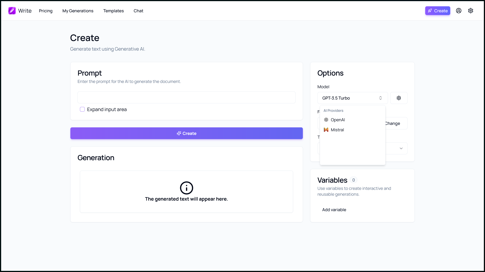
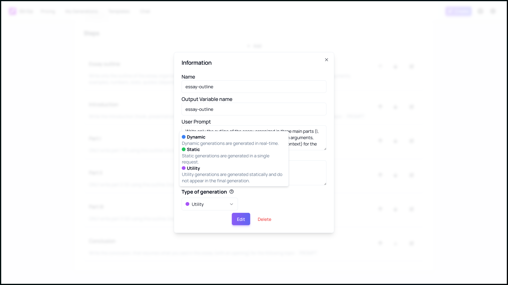
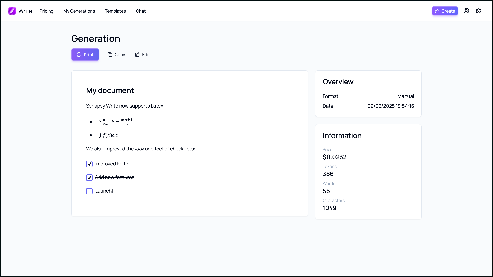

Synapsy Write v3.3.0 is here, and it's packed with exciting new features and improvements designed to enhance your document generation and text content creation experience. Let's dive into the key updates that make this release stand out.

## New Model Selector

One of the most significant additions in Synapsy Write v3.3.0 is the new model selector. This feature allows you to choose from a variety of AI models tailored to different types of content generation. Whether you need a model that excels in creative writing, technical documentation, or general text generation, the model selector ensures you have the right tool for the job. This flexibility empowers users to produce high-quality content that meets their specific needs.

## Enhanced Template Editor

The Template Editor in Synapsy Write v3.3.0 has been significantly enhanced with the introduction of a new type UI system. This system allows you to select between different types of generation modes, providing greater flexibility and control over your content creation process. Here's what you can expect:

-   **Dynamic**: This generation type is streamed and included in the final output. It's perfect for realtime feedback for the user.

-   **Static**: This generation type is not streamed but is included in the final output. It's perfect for content that doesn't require real-time updates but needs to be part of the final document, offering stability and consistency.

-   **Utility**: This generation type is static and not included in the final output. It's useful for creating helper templates or drafts that assist in the content creation process without being part of the end document, allowing for better organization and efficiency.

With the new type UI system, you can easily switch between these generation modes to tailor your templates to your specific needs, making the content creation process more versatile and efficient.

## Improved Editor with Math and LaTeX Support

The Editor in Synapsy Write v3.3.0 has been significantly improved with the addition of Math and LaTeX support. This feature is now used by default in the view generation page, making it easier than ever to include mathematical expressions and scientific notation in your documents. Whether you're writing a research paper, creating educational content, or drafting technical documentation, the enhanced editor ensures your mathematical expressions are accurately represented.

## Additional Features and Improvements

-   **Reset Settings**: You can now reset settings to their default values, providing a quick way to start fresh if needed.
-   **Duplicate Templates**: Easily duplicate system and user templates to create variations or backups of your existing templates.
-   **Loading UI**: A new loading UI has been added when switching pages, providing a smoother and more intuitive user experience.
-   **Novel Editor as Default**: The Novel editor is now the default for the View page, offering a streamlined and efficient editing experience.

## Bug Fixes and Updates

Synapsy Write v3.3.0 also includes several bug fixes and updates to ensure a stable and reliable user experience. Issues with generation types, lists, checklists, and specific AI models have been addressed. Additionally, the CI trigger events and Radix UI have been updated, and legacy features have been removed to keep the tool modern and efficient.

## Conclusion

Synapsy Write v3.3.0 brings a host of new features and improvements that make document generation more powerful and flexible than ever before. Whether you're a writer, educator, or technical professional, these updates will help you create high-quality content with ease. Upgrade to Synapsy Write v3.3.0 today and experience the future of AI-powered document generation!

Stay tuned for more updates and enhancements as we continue to innovate and improve Synapsy Write. Happy writing!

## Launch

[Click here](https://write.peyronnet.group) to launch the app.

## Changelog

### New

-   Added the possibility to reset settings (#1396)
-   Added new Icons components
-   Added new model selector (#1397)
-   Added the possibility to duplicate a system Template (#1398)
-   Added the possibility to duplicate a template (#1398)
-   Added new template step type system (#1399)
-   Added type UI to Edit Template page (#1399)
-   Added type UI to View Template page (#1399)
-   Added Codestral models back
-   Added Loading UI when switching page (#1400)
-   Added Math and Latex support (#1401)
-   Added Novel editor as default for View page (#1401)

### Fixed

-   Fixed CI
-   Fixed an issue with new generation type (#1399)
-   Fixed an issue with lists and check lists (#1401)
-   Fixed an issue with Mistral models

### Updated

-   Updated CI trigger events
-   Updated Radix UI
-   Removed legacy refresh button in Model Selector (#1397)
-   Refactored AI Completions
-   _Updated dependencies_
