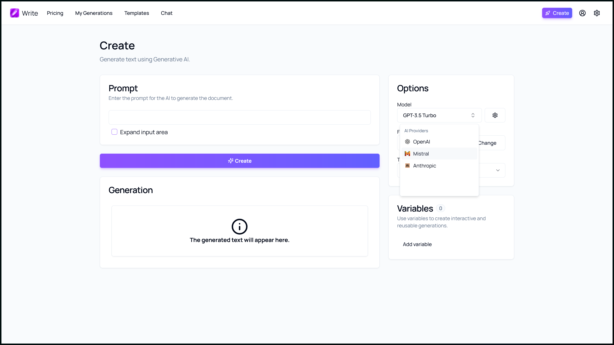

Synapsy Write v3.4.0 is here, bringing a suite of new features, fixes, and updates designed to enhance your document generation experience. Let's delve into the key highlights of this release and see how they can elevate your content creation process.

## Anthropic AI Provider

One of the most exciting additions in Synapsy Write v3.4.0 is the integration of the Anthropic AI Provider. This new AI provider expands the capabilities of Synapsy Write, offering users access to advanced AI models that can generate more sophisticated and contextually relevant content. With Anthropic on board, you can expect even more powerful and intuitive text generation features.

## Updates

### Pricing Table

The pricing table has been updated to reflect the latest offerings and plans. This update provides clearer information on the available options, helping you choose the plan that best suits your needs.

### TailwindCSS 4

Synapsy Write has been upgraded to TailwindCSS 4, bringing a modern and responsive design to the interface. This upgrade enhances the user experience with improved aesthetics and functionality.

## Conclusion

Synapsy Write v3.4.0 is packed with new features and improvements that make document generation more powerful and user-friendly. Whether you're a writer, educator, or technical professional, these updates will help you create high-quality content with ease.

Stay tuned for more updates and enhancements as we continue to innovate and improve Synapsy Write.

## Launch

[Click here](https://write.peyronnet.group) to launch the app.

## Changelog

### New

-   Added Anthropic AI Provider
-   Refactored Plan detection system
-   Added support for new models

### Fixed

-   Fixed an issue with Novel Editor (#1497)
-   Fixed an issue with undefined Anthropic models
-   Fixed an issue with Result Displayer not working
-   Fixed Anthropic not working in browser
-   Fixed an issue with editor removing generation content
-   Fixed an issue on Linux devices
-   Fixed forward ref issue

### Updated

-   Updated pricing table
-   Upgraded to TailwindCSS 4
-   Updated dependencies
-   Removed old grid background
